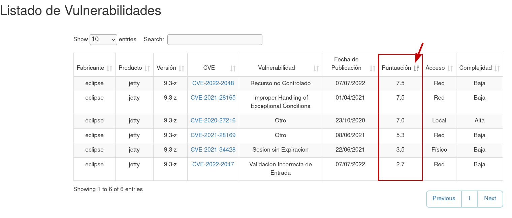
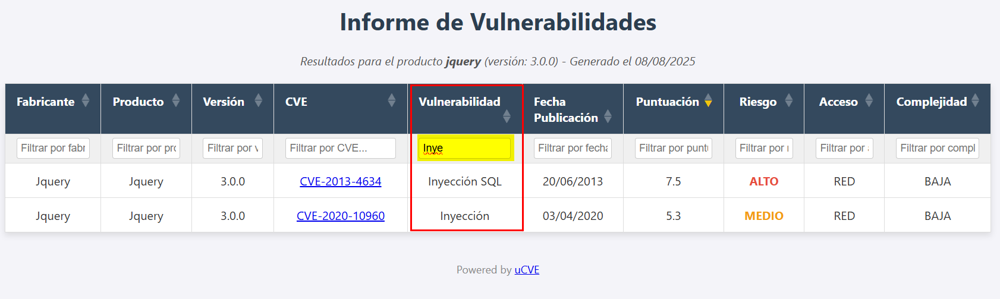

<p align="center">
  
  <br>
  <p align="center">
  <a href="https://github.com/m3n0sd0n4ld/uCVE/releases/tag/1.0">
    
  </a>
  <a href="https://github.com/m3n0sd0n4ld/uCVE/issues?q=is%3Aissue+is%3Aopen">
    
  <a href="https://github.com/m3n0sd0n4ld/uCVE/commits/master">
    
  </a>
  <h1 align="center">uCVE - Fast CVE Reporting</h1>
  <br>
</p>
    
## Description
**uCVE** is a tool written in GO that allows to extract CVE's related to a specific software and version, obtaining a report in HTML format with the result and/or exporting it to the pentesting report.
    
## Download and install
```
git clone https://github.com/m3n0sd0n4ld/uCVE.git
cd uCVE
go build uCVE uCVE.go
```
### Download the compiled binary for Windows, Linux or MacOS
[Download the latest version](https://github.com/m3n0sd0n4ld/uCVE/releases)
    
### Error: version 'GLIBC_2.32' not found (Any Ubuntu version/Debian/Kali/Parrot OS 64bits)
```
git clone https://github.com/m3n0sd0n4ld/uCVE.git
cd uCVE
GOOS=linux GOARCH=amd64 CGO_ENABLED=0 go build -o uCVE uCVE.go
``` 
    
## Use
### Menu
```
> uCVE -h


	          .d8888b.  888     888 8888888888 
	         d88P  Y88b 888     888 888        
	         888    888 888     888 888        
	888  888 888        Y88b   d88P 8888888    
	888  888 888         Y88b d88P  888        
	888  888 888    888   Y88o88P   888        
	Y88b 888 Y88b  d88P    Y888P    888        
	 "Y88888  "Y8888P"      Y8P     8888888888 

	    by M3n0sD0n4ld and Siriil
			

uCVE parameter:

    -cvss: Filter vulnerabilities by CVSS [all,critical,high,medium,low,none] (default is all)
    -p: Search CVEs by product software (required)
    -v: Show version
    -vp: Set version on product software (required)

Usage:
    uCVE -p <product> -vp <version_product> [-cvss (all,critical,high,medium,low,none)]

Examples:
    uCVE -p jquery -vp 1.2.1
    uCVE -p sunos -vp 5.5.1 -cvss critical,high,medium

```

### CVE's search by default (includes all types of criticality)
```
> uCVE -p jquery -vp 1.2.1


	          .d8888b.  888     888 8888888888 
	         d88P  Y88b 888     888 888        
	         888    888 888     888 888        
	888  888 888        Y88b   d88P 8888888    
	888  888 888         Y88b d88P  888        
	888  888 888    888   Y88o88P   888        
	Y88b 888 Y88b  d88P    Y888P    888        
	 "Y88888  "Y8888P"      Y8P     8888888888 

	    by M3n0sD0n4ld and Siriil
			

[!] This could take a few minutes, please wait...

[+] Results 7 found, then processing

[+] Results saved in 'jquery_1.2.1.html'

```
### Search for CVE's by filtering by criticality (separated by commas and without spaces).
```
> uCVE -p tomcat -vp 8.0.53 -cvss critical,high


	          .d8888b.  888     888 8888888888 
	         d88P  Y88b 888     888 888        
	         888    888 888     888 888        
	888  888 888        Y88b   d88P 8888888    
	888  888 888         Y88b d88P  888        
	888  888 888    888   Y88o88P   888        
	Y88b 888 Y88b  d88P    Y888P    888        
	 "Y88888  "Y8888P"      Y8P     8888888888 

	    by M3n0sD0n4ld and Siriil
			

[!] This could take a few minutes, please wait...

[+] Results 2 found, then processing

[+] Results saved in 'tomcat_8.0.53.html'

```

### Viewing the report
uCVE allows you to sort by CVE identifier, date, vulnerability type, score... Ideal for reporting in your pentesting reports!
	  

	  
In addition, it also incorporates a search engine to filter by type of vulnerability or attack.
	  

	  
## Credits

###### Authors: 
- [Iván Santos (AKA. Siriil)](https://es.linkedin.com/in/siriil/)
- [David Utón (AKA. M3n0sd0n4ld)](https://twitter.com/David_Uton)
    
## Disclaimer and Acknowledgments
The authors of the tool are not responsible for the misuse of the tool, nor are they responsible for errors in the information obtained and shown in the report.

All information is obtained from the official resource [https://cve.mitre.org](https://cve.mitre.org).

Thanks to **MITRE** and the users who use **uCVE**.
