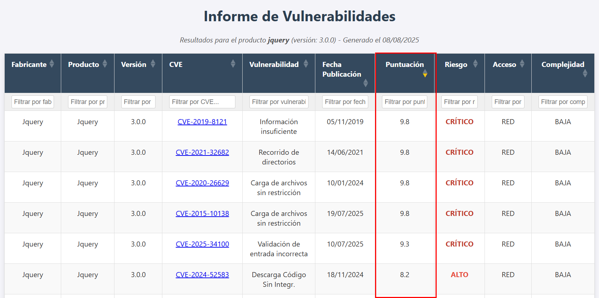

<p align="center">
  
  <br>
  <p align="center">
  <a href="https://github.com/m3n0sd0n4ld/uCVE/releases/tag/">
    
  </a>
  <a href="https://github.com/m3n0sd0n4ld/uCVE/issues?q=is%3Aissue+is%3Aopen">
    
  <a href="https://github.com/m3n0sd0n4ld/uCVE/commits/master">
    
  </a>
  <h1 align="center">uCVE - Fast CVE Reporting</h1>
  <br>
</p>
    
## Description
**uCVE** is a tool written in GO that allows to extract CVE's related to a specific software and version, obtaining a report in HTML format with the result and/or exporting it to the pentesting report.
    
## Download and install
```console
git clone https://github.com/m3n0sd0n4ld/uCVE.git
cd uCVE
go build -o uCVE uCVE.go
```
### Download the compiled binary for Windows, Linux or MacOS
[Download the latest version](https://github.com/m3n0sd0n4ld/uCVE/releases)
    
    
## Use
### Menu
```console
> uCVE -h

         ___________    ___________
  ____  ___  ____/_ |  / /__  ____/
  _  / / /  /    __ | / /__  __/
  / /_/ // /___  __ |/ / _  /___
  \__,_/ \____/  _____/  /_____/ v.3.1

          by M3n0sD0n4ld and Siriil


Use: uCVE -s <product> [-lg <en|es>] [-r <risks>] [-e <vendors>] [-i <vendors>] [-o <filename.txt>] [-oHTML <filename.html>] [-oJSON <filename.json>] [-oCSV <filename.csv>] [-x <host:port>]

Parameters:
  -s          Product to search for, optionally including version (example: crushftp, 'jquery 3.5.1')
  -lg         Language (en or es), optional, default "en"
  -r          Risk levels to filter (comma-separated, example: critical,high)
  -e          Vendors to exclude (comma-separated, example: jquery,jqueryui)
  -i          Vendors to include (comma-separated, example: jquery,jqueryui)
  -o          Name of the text file to save the console output (optional)
  -oHTML      Output HTML file name (optional)
  -oJSON      Output JSON file name (optional)
  -oCSV       Output CSV file name (optional)
  -x          HTTP proxy (host:port format) (optional)
  -h          Show helplp
```

### CVE's search by default (includes all types of criticality)
```console
> uCVE -s "Jquery 3.3.1"

         ___________    ___________
  ____  ___  ____/_ |  / /__  ____/
  _  / / /  /    __ | / /__  __/
  / /_/ // /___  __ |/ / _  /___
  \__,_/ \____/  _____/  /_____/ v.3.1

          by M3n0sD0n4ld and Siriil

[+] 13 results for Jquery 3.3.1
┌────────────────────────┬──────────────────────────────┬────────────┬────────────────┬─────────────────────────────────────┬───────────────────┬────────────┬──────────┬──────────────┬─────────────┐
│ Vendor                 │ Product                      │ Version    │ CVE            │ Vulnerability                       │ Published Date    │ Score      │ Risk     │ Access       │ Complexity  │
├────────────────────────┼──────────────────────────────┼────────────┴────────────────┴─────────────────────────────────────┴───────────────────┴────────────┴──────────┴──────────────┴─────────────┘
│ Wicket-Jquery-Ui Pr... │ Wicket-Jquery-Ui             │ 3.3.1      │ CVE-2017-15719 │ Cross-site Scripting                │ 03/12/2018        │ 4.3        │ MEDIUM   │ NETWORK      │ MEDIUM      │
│ Jquery File Upload ... │ Jquery File Upload           │ 3.3.1      │ CVE-2018-9206  │ Unrestricted File Upload            │ 10/11/2018        │ 9.8        │ CRITICAL │ NETWORK      │ LOW         │
│ Hayageek               │ Jquery Upload File           │ 3.3.1      │ CVE-2018-9207  │ Unrestricted File Upload            │ 11/19/2018        │ 7.5        │ HIGH     │ NETWORK      │ LOW         │
│ Jquery                 │ Jquery                       │ 3.3.1      │ CVE-2019-11358 │ Prototype Pollution                 │ 04/20/2019        │ 6.1        │ MEDIUM   │ NETWORK      │ LOW         │
│ Jquery                 │ Jquery                       │ 3.3.1      │ CVE-2020-11023 │ Cross-site Scripting                │ 04/29/2020        │ 6.9        │ MEDIUM   │ NETWORK      │ HIGH        │
│ Jquery                 │ Jquery                       │ 3.3.1      │ CVE-2020-11022 │ Cross-site Scripting                │ 04/29/2020        │ 6.9        │ MEDIUM   │ NETWORK      │ HIGH        │
│ Jqueryform             │ Jqueryform                   │ 3.3.1      │ CVE-2022-24981 │ Cross-site Scripting                │ 02/16/2022        │ 6.1        │ MEDIUM   │ NETWORK      │ LOW         │
│ Jqueryform             │ Jqueryform                   │ 3.3.1      │ CVE-2022-24982 │ Weak Credentials                    │ 02/16/2022        │ 6.5        │ MEDIUM   │ NETWORK      │ LOW         │
│ Jqueryform             │ Jqueryform                   │ 3.3.1      │ CVE-2022-24983 │ Path Traversal                      │ 02/16/2022        │ 7.5        │ HIGH     │ NETWORK      │ LOW         │
│ Jqueryform             │ Jqueryform                   │ 3.3.1      │ CVE-2022-24984 │ Unrestricted File Upload            │ 02/16/2022        │ 9.8        │ CRITICAL │ NETWORK      │ LOW         │
│ Jqueryform             │ Jqueryform                   │ 3.3.1      │ CVE-2022-24985 │ Other                               │ 02/16/2022        │ 8.8        │ HIGH     │ NETWORK      │ LOW         │
│ Jquery Validation F... │ Jquery Validation For Con... │ 3.3.1      │ CVE-2022-2144  │ Cross-Site Request Forgery (CSRF)   │ 07/17/2022        │ 4.3        │ MEDIUM   │ NETWORK      │ LOW         │
│ Gopiplus               │ Jquery Accordion Slideshow   │ 3.3.1      │ CVE-2023-5464  │ Other                               │ 10/31/2023        │ 8.8        │ HIGH     │ NETWORK      │ LOW         │
└────────────────────────┴──────────────────────────────┴────────────┴────────────────┴─────────────────────────────────────┴───────────────────┴────────────┴──────────┴──────────────┴─────────────┘
```

### Search for CVE's by filtering by criticality (separated by commas and without spaces).
```console
❯ uCVE -s "Tomcat 8.5.4" -i apache -r critical,high,medium -oHTML tomcat-8.5.4.html

         ___________    ___________
  ____  ___  ____/_ |  / /__  ____/
  _  / / /  /    __ | / /__  __/
  / /_/ // /___  __ |/ / _  /___
  \__,_/ \____/  _____/  /_____/ v.3.1

          by M3n0sD0n4ld and Siriil

[+] 56 results for Tomcat 8.5.4
┌────────────────────────┬──────────────────────────────┬────────────┬────────────────┬─────────────────────────────────────┬───────────────────┬────────────┬──────────┬──────────────┬─────────────┐
│ Vendor                 │ Product                      │ Version    │ CVE            │ Vulnerability                       │ Published Date    │ Score      │ Risk     │ Access       │ Complexity  │
├────────────────────────┼──────────────────────────────┼────────────┴────────────────┴─────────────────────────────────────┴───────────────────┴────────────┴──────────┴──────────────┴─────────────┘
│ Apache                 │ Tomcat                       │ 8.5.4      │ CVE-2016-5388  │ Improper Access Control             │ 07/19/2016        │ 5.1        │ MEDIUM   │ NETWORK      │ HIGH        │
│ Apache                 │ Tomcat                       │ 8.5.4      │ CVE-2016-6816  │ Improper Input Validation           │ 03/20/2017        │ 6.8        │ MEDIUM   │ NETWORK      │ MEDIUM      │
│ Apache                 │ Tomcat                       │ 8.5.4      │ CVE-2016-8735  │ Insufficient Information            │ 04/06/2017        │ 9.8        │ CRITICAL │ NETWORK      │ LOW         │
│ Apache                 │ Tomcat                       │ 8.5.4      │ CVE-2017-5647  │ Sensitive Info Exposure             │ 04/17/2017        │ 5.0        │ MEDIUM   │ NETWORK      │ LOW         │
│ Apache                 │ Tomcat                       │ 8.5.4      │ CVE-2017-5648  │ Resource Exposure                   │ 04/17/2017        │ 6.4        │ MEDIUM   │ NETWORK      │ LOW         │
│ Apache                 │ Tomcat                       │ 8.5.4      │ CVE-2017-5650  │ Improper Resource Release           │ 04/17/2017        │ 5.0        │ MEDIUM   │ NETWORK      │ LOW         │
│ Apache                 │ Tomcat                       │ 8.5.4      │ CVE-2017-5651  │ Insufficient Information            │ 04/17/2017        │ 7.5        │ HIGH     │ NETWORK      │ LOW         │
│ Apache                 │ Tomcat                       │ 8.5.4      │ CVE-2017-5664  │ Exceptional Cond. Handling          │ 06/06/2017        │ 5.0        │ MEDIUM   │ NETWORK      │ LOW         │
│ Apache                 │ Tomcat                       │ 8.5.4      │ CVE-2016-0762  │ Observable Discrepancy              │ 08/10/2017        │ 5.9        │ MEDIUM   │ NETWORK      │ HIGH        │
│ Apache                 │ Tomcat                       │ 8.5.4      │ CVE-2016-5018  │ Insufficient Information            │ 08/10/2017        │ 9.1        │ CRITICAL │ NETWORK      │ LOW         │
│ Apache                 │ Tomcat                       │ 8.5.4      │ CVE-2016-6794  │ Insufficient Information            │ 08/10/2017        │ 5.3        │ MEDIUM   │ NETWORK      │ LOW         │
│ Apache                 │ Tomcat                       │ 8.5.4      │ CVE-2016-6797  │ Incorrect Authorization             │ 08/10/2017        │ 7.5        │ HIGH     │ NETWORK      │ LOW         │
│ Apache                 │ Tomcat                       │ 8.5.4      │ CVE-2016-6817  │ Improper Mem. Buffer Restr.         │ 08/10/2017        │ 7.5        │ HIGH     │ NETWORK      │ LOW         │
│ Apache                 │ Tomcat                       │ 8.5.4      │ CVE-2016-8745  │ Error Handling                      │ 08/10/2017        │ 5.0        │ MEDIUM   │ NETWORK      │ LOW         │
│ Apache                 │ Tomcat                       │ 8.5.4      │ CVE-2016-6796  │ Insufficient Information            │ 08/11/2017        │ 7.5        │ HIGH     │ NETWORK      │ LOW         │
│ Apache                 │ Tomcat                       │ 8.5.4      │ CVE-2017-7674  │ Data Authenticity Fail              │ 08/11/2017        │ 4.3        │ MEDIUM   │ NETWORK      │ MEDIUM      │
│ Apache                 │ Tomcat                       │ 8.5.4      │ CVE-2017-7675  │ Path Traversal                      │ 08/11/2017        │ 5.0        │ MEDIUM   │ NETWORK      │ LOW         │
│ Apache                 │ Tomcat                       │ 8.5.4      │ CVE-2017-12617 │ Unrestricted File Upload            │ 10/04/2017        │ 8.1        │ HIGH     │ NETWORK      │ HIGH        │
│ Apache                 │ Tomcat                       │ 8.5.4      │ CVE-2018-1305  │ Insufficient Information            │ 02/23/2018        │ 4.0        │ MEDIUM   │ NETWORK      │ LOW         │
│ Apache                 │ Tomcat                       │ 8.5.4      │ CVE-2018-1304  │ Insufficient Information            │ 02/28/2018        │ 4.3        │ MEDIUM   │ NETWORK      │ MEDIUM      │
│ Apache                 │ Tomcat                       │ 8.5.4      │ CVE-2018-8014  │ Insecure Default Init.              │ 05/16/2018        │ 7.5        │ HIGH     │ NETWORK      │ LOW         │
│ Apache                 │ Tomcat                       │ 8.5.4      │ CVE-2018-8034  │ Improper Cert Validation            │ 08/01/2018        │ 7.5        │ HIGH     │ NETWORK      │ LOW         │
│ Apache                 │ Tomcat                       │ 8.5.4      │ CVE-2018-1336  │ Infinite Loop                       │ 08/02/2018        │ 7.5        │ HIGH     │ NETWORK      │ LOW         │
│ Apache                 │ Tomcat                       │ 8.5.4      │ CVE-2018-11784 │ URL Redirect to Untrusted           │ 10/04/2018        │ 4.3        │ MEDIUM   │ NETWORK      │ MEDIUM      │
│ Apache                 │ Tomcat                       │ 8.5.4      │ CVE-2019-0199  │ Uncontrolled Resource Use           │ 04/10/2019        │ 5.0        │ MEDIUM   │ NETWORK      │ LOW         │
│ Apache                 │ Tomcat                       │ 8.5.4      │ CVE-2019-0232  │ OS Command Injection                │ 04/15/2019        │ 9.3        │ CRITICAL │ NETWORK      │ MEDIUM      │
│ Apache                 │ Tomcat                       │ 8.5.4      │ CVE-2019-0221  │ Cross-site Scripting                │ 05/28/2019        │ 4.3        │ MEDIUM   │ NETWORK      │ MEDIUM      │
│ Apache                 │ Tomcat                       │ 8.5.4      │ CVE-2019-10072 │ Improper Locking                    │ 06/21/2019        │ 5.0        │ MEDIUM   │ NETWORK      │ LOW         │
│ Apache                 │ Tomcat                       │ 8.5.4      │ CVE-2019-17563 │ Session Fixation                    │ 12/23/2019        │ 7.5        │ HIGH     │ NETWORK      │ HIGH        │
│ Apache                 │ Tomcat                       │ 8.5.4      │ CVE-2019-12418 │ Insufficient Information            │ 12/23/2019        │ 7.0        │ HIGH     │ LOCAL        │ HIGH        │
│ Apache                 │ Tomcat                       │ 8.5.4      │ CVE-2019-17569 │ HTTP Smuggling                      │ 02/24/2020        │ 4.8        │ MEDIUM   │ NETWORK      │ HIGH        │
│ Apache                 │ Tomcat                       │ 8.5.4      │ CVE-2020-1935  │ HTTP Smuggling                      │ 02/24/2020        │ 4.8        │ MEDIUM   │ NETWORK      │ HIGH        │
│ Apache                 │ Tomcat                       │ 8.5.4      │ CVE-2020-1938  │ Other                               │ 02/24/2020        │ 9.8        │ CRITICAL │ NETWORK      │ LOW         │
│ Apache                 │ Tomcat                       │ 8.5.4      │ CVE-2020-9484  │ Untrusted Deserialization           │ 05/20/2020        │ 7.0        │ HIGH     │ LOCAL        │ HIGH        │
│ Apache                 │ Tomcat                       │ 8.5.4      │ CVE-2020-11996 │ Insufficient Information            │ 06/26/2020        │ 7.5        │ HIGH     │ NETWORK      │ LOW         │
│ Apache                 │ Tomcat                       │ 8.5.4      │ CVE-2020-8022  │ Incorrect Default Perms             │ 06/29/2020        │ 7.7        │ HIGH     │ LOCAL        │ LOW         │
│ Apache                 │ Tomcat                       │ 8.5.4      │ CVE-2020-13934 │ Missing Mem. Release                │ 07/14/2020        │ 7.5        │ HIGH     │ NETWORK      │ LOW         │
│ Apache                 │ Tomcat                       │ 8.5.4      │ CVE-2020-13935 │ Infinite Loop                       │ 07/14/2020        │ 7.5        │ HIGH     │ NETWORK      │ LOW         │
│ Apache                 │ Tomcat                       │ 8.5.4      │ CVE-2020-13943 │ Insufficient Information            │ 10/12/2020        │ 4.3        │ MEDIUM   │ NETWORK      │ LOW         │
│ Apache                 │ Tomcat                       │ 8.5.4      │ CVE-2020-17527 │ Sensitive Info Exposure             │ 12/03/2020        │ 7.5        │ HIGH     │ NETWORK      │ LOW         │
│ Apache                 │ Tomcat                       │ 8.5.4      │ CVE-2021-24122 │ Sensitive Info Exposure             │ 01/14/2021        │ 5.9        │ MEDIUM   │ NETWORK      │ HIGH        │
│ Apache                 │ Tomcat                       │ 8.5.4      │ CVE-2021-25122 │ Sensitive Info Exposure             │ 03/01/2021        │ 7.5        │ HIGH     │ NETWORK      │ LOW         │
│ Apache                 │ Tomcat                       │ 8.5.4      │ CVE-2021-25329 │ Insufficient Information            │ 03/01/2021        │ 7.0        │ HIGH     │ LOCAL        │ HIGH        │
│ Apache                 │ Tomcat                       │ 8.5.4      │ CVE-2021-30640 │ Improper Output Encoding            │ 07/12/2021        │ 6.5        │ MEDIUM   │ NETWORK      │ HIGH        │
│ Apache                 │ Tomcat                       │ 8.5.4      │ CVE-2021-33037 │ HTTP Smuggling                      │ 07/12/2021        │ 5.3        │ MEDIUM   │ NETWORK      │ LOW         │
│ Apache                 │ Tomcat                       │ 8.5.4      │ CVE-2021-41079 │ Improper Input Validation           │ 09/16/2021        │ 7.5        │ HIGH     │ NETWORK      │ LOW         │
│ Apache                 │ Tomcat                       │ 8.5.4      │ CVE-2022-25762 │ Improper Resource Release           │ 05/13/2022        │ 8.6        │ HIGH     │ NETWORK      │ LOW         │
│ Apache                 │ Tomcat                       │ 8.5.4      │ CVE-2022-42252 │ HTTP Smuggling                      │ 11/01/2022        │ 7.5        │ HIGH     │ NETWORK      │ LOW         │
│ Apache                 │ Tomcat                       │ 8.5.4      │ CVE-2023-28708 │ Unsecured Cred. Transport           │ 03/22/2023        │ 4.3        │ MEDIUM   │ NETWORK      │ LOW         │
│ Apache                 │ Tomcat                       │ 8.5.4      │ CVE-2023-41080 │ URL Redirect to Untrusted           │ 08/25/2023        │ 6.1        │ MEDIUM   │ NETWORK      │ LOW         │
│ Apache                 │ Tomcat                       │ 8.5.4      │ CVE-2023-42795 │ Incomplete Cleanup                  │ 10/10/2023        │ 5.3        │ MEDIUM   │ NETWORK      │ LOW         │
│ Apache                 │ Tomcat                       │ 8.5.4      │ CVE-2023-45648 │ Improper Input Validation           │ 10/10/2023        │ 5.3        │ MEDIUM   │ NETWORK      │ LOW         │
│ Apache                 │ Tomcat                       │ 8.5.4      │ CVE-2023-46589 │ HTTP Smuggling                      │ 11/28/2023        │ 7.5        │ HIGH     │ NETWORK      │ LOW         │
│ Apache                 │ Tomcat                       │ 8.5.4      │ CVE-2024-23672 │ Incomplete Cleanup                  │ 03/13/2024        │ 6.3        │ MEDIUM   │ NETWORK      │ LOW         │
│ Apache                 │ Tomcat                       │ 8.5.4      │ CVE-2024-24549 │ Improper Input Validation           │ 03/13/2024        │ 7.5        │ HIGH     │ NETWORK      │ LOW         │
│ Apache                 │ Tomcat                       │ 8.5.4      │ CVE-2025-24813 │ Other                               │ 03/10/2025        │ 9.8        │ CRITICAL │ NETWORK      │ LOW         │
└────────────────────────┴──────────────────────────────┴────────────┴────────────────┴─────────────────────────────────────┴───────────────────┴────────────┴──────────┴──────────────┴─────────────┘
[+] Vulnerabilities table exported to 'tomcat-8.5.4.html'
```

### Viewing the report
uCVE allows you to sort by CVE identifier, date, vulnerability type, score... Ideal for reporting in your pentesting reports!
	  

	  
In addition, it also incorporates multiple filters with a search engine, allowing you to achieve better results.
	  

	  
Similarly, the same options are available in English:
	  

	  
## Credits

###### Authors: 
- [Iván Santos (AKA. Siriil)](https://es.linkedin.com/in/siriil/)
- [David Utón (AKA. M3n0sd0n4ld)](https://twitter.com/David_Uton)
    
## Disclaimer and Acknowledgments
The authors of the tool are not responsible for the misuse of the tool, nor are they responsible for errors in the information obtained and shown in the report.

All information is obtained from the official resource [https://cve.mitre.org](https://cve.mitre.org).

Thanks to **MITRE** and the users who use **uCVE**.
