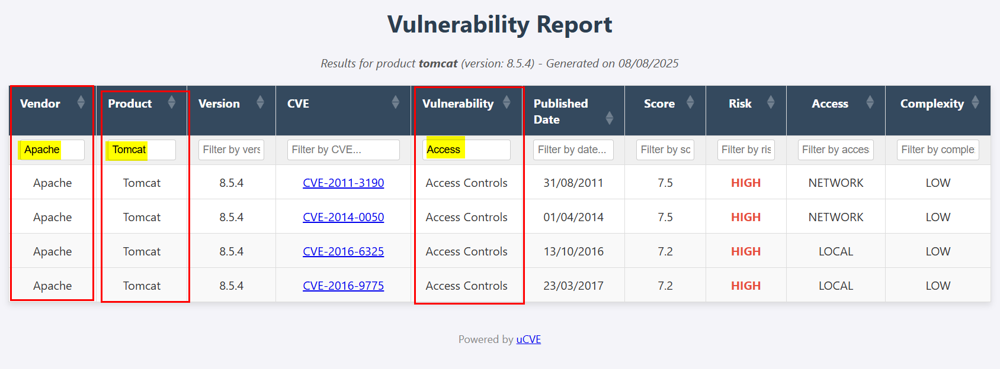

<p align="center">
  
  <br>
  <p align="center">
  <a href="https://github.com/m3n0sd0n4ld/uCVE/releases/tag/">
    
  </a>
  <a href="https://github.com/m3n0sd0n4ld/uCVE/issues?q=is%3Aissue+is%3Aopen">
    
  <a href="https://github.com/m3n0sd0n4ld/uCVE/commits/master">
    
  </a>
  <h1 align="center">uCVE - Fast CVE Reporting</h1>
  <br>
</p>
    
## Description
**uCVE** is a tool written in GO that allows to extract CVE's related to a specific software and version, obtaining a report in HTML format with the result and/or exporting it to the pentesting report.
    
## Download and install
```console
git clone https://github.com/m3n0sd0n4ld/uCVE.git
cd uCVE
go build -o uCVE uCVE.go
```
### Download the compiled binary for Windows, Linux or MacOS
[Download the latest version](https://github.com/m3n0sd0n4ld/uCVE/releases)
    
    
## Use
### Menu
```console
> uCVE -h

         ___________    ___________
  ____  ___  ____/_ |  / /__  ____/
  _  / / /  /    __ | / /__  __/
  / /_/ // /___  __ |/ / _  /___
  \__,_/ \____/  _____/  /_____/ v.3.0

          by M3n0sD0n4ld and Siriil


Use: uCVE -s <product> -vp <version> [-lg <en|es>] [-r <risks>] [-e <vendors>] [-i <vendors>] [-o <filename.txt>] [-oHTML <filename.html>] [-oJSON <filename.json>] [-oCSV <filename.csv>] [-x <host:port>]

Parameters:
  -s          Product to search for (example: crushftp, jquery)
  -vp         Product version (required, example: 10.8.4)
  -lg         Language (en or es), optional, default "en"
  -r          Risk levels to filter (comma-separated, example: critical,high)
  -e          Vendors to exclude (comma-separated, example: Dennis Bruecke,Jqueryui)
  -i          Vendors to include (comma-separated, example: jquery,jqueryui)
  -o          Name of the text file to save the console output (optional)
  -oHTML      Output HTML file name (optional)
  -oJSON      Output JSON file name (optional)
  -oCSV       Output CSV file name (optional)
  -x          HTTP proxy (host:port format) (optional)
  -h          Show help
```

### CVE's search by default (includes all types of criticality)
```console
> uCVE -s tomcat -vp 8.5.4

         ___________    ___________
  ____  ___  ____/_ |  / /__  ____/
  _  / / /  /    __ | / /__  __/
  / /_/ // /___  __ |/ / _  /___
  \__,_/ \____/  _____/  /_____/ v.3.0

          by M3n0sD0n4ld and Siriil

[+] 346 results for tomcat, version: 8.5.4

┌──────────────────┬──────────────────────┬─────────┬────────────────┬─────────────────────────────────────┬───────────────────┬────────────┬──────────┬──────────────┬─────────────┐
│ Vendor           │ Product              │ Version │ CVE            │ Vulnerability                       │ Published Date    │ Score      │ Risk     │ Access       │ Complexity  │
├──────────────────┼──────────────────────┼─────────┼────────────────┼─────────────────────────────────────┼───────────────────┼────────────┼──────────┼──────────────┼─────────────┤
│ Apache           │ Tomcat               │ 8.5.4   │ CVE-2000-0672  │ Insufficient Information            │ 20/07/2000        │ 5.0        │ MEDIUM   │ NETWORK      │ LOW         │
│ Apache           │ Tomcat               │ 8.5.4   │ CVE-2000-0759  │ Other                               │ 20/10/2000        │ 6.4        │ MEDIUM   │ NETWORK      │ LOW         │
│ Apache           │ Tomcat               │ 8.5.4   │ CVE-2000-0760  │ Other                               │ 20/10/2000        │ 6.4        │ MEDIUM   │ NETWORK      │ LOW         │
│ Apache           │ Tomcat               │ 8.5.4   │ CVE-2001-0590  │ Other                               │ 02/08/2001        │ 5.0        │ MEDIUM   │ NETWORK      │ LOW         │
│ Apache           │ Tomcat               │ 8.5.4   │ CVE-2001-0917  │ Other                               │ 22/11/2001        │ 5.0        │ MEDIUM   │ NETWORK      │ LOW         │
│ Apache           │ Tomcat               │ 8.5.4   │ CVE-2001-0829  │ Other                               │ 06/12/2001        │ 5.1        │ MEDIUM   │ NETWORK      │ HIGH        │
│ Apache           │ Tomcat               │ 8.5.4   │ CVE-2001-1563  │ Other                               │ 31/12/2001        │ 7.5        │ HIGH     │ NETWORK      │ LOW         │
│ Apache           │ Tomcat               │ 8.5.4   │ CVE-2000-1210  │ Other                               │ 22/03/2002        │ 5.0        │ MEDIUM   │ NETWORK      │ LOW         │
│ Apache           │ Tomcat               │ 8.5.4   │ CVE-2002-0682  │ Other                               │ 23/07/2002        │ 7.5        │ HIGH     │ NETWORK      │ LOW         │
│ Apache           │ Tomcat               │ 8.5.4   │ CVE-2002-0493  │ Security Features                   │ 12/08/2002        │ 7.5        │ HIGH     │ NETWORK      │ LOW         │
│ Apache           │ Tomcat               │ 8.5.4   │ CVE-2002-0935  │ Other                               │ 04/10/2002        │ 5.0        │ MEDIUM   │ NETWORK      │ LOW         │
│ Apache           │ Tomcat               │ 8.5.4   │ CVE-2002-0936  │ Other                               │ 04/10/2002        │ 5.0        │ MEDIUM   │ NETWORK      │ LOW         │
│ Apache           │ Tomcat               │ 8.5.4   │ CVE-2002-1148  │ Other                               │ 11/10/2002        │ 5.0        │ MEDIUM   │ NETWORK      │ LOW         │
│ Apache           │ Tomcat               │ 8.5.4   │ CVE-2002-1895  │ Other                               │ 31/12/2002        │ 5.0        │ MEDIUM   │ NETWORK      │ LOW         │
│ Apache           │ Tomcat               │ 8.5.4   │ CVE-2002-2006  │ Other                               │ 31/12/2002        │ 5.0        │ MEDIUM   │ NETWORK      │ LOW         │
│ Apache           │ Tomcat               │ 8.5.4   │ CVE-2002-2007  │ Other                               │ 31/12/2002        │ 5.0        │ MEDIUM   │ NETWORK      │ LOW         │
│ Apache           │ Tomcat               │ 8.5.4   │ CVE-2002-2008  │ Other                               │ 31/12/2002        │ 5.0        │ MEDIUM   │ NETWORK      │ LOW         │
│ Apache           │ Tomcat               │ 8.5.4   │ CVE-2002-2009  │ Other                               │ 31/12/2002        │ 5.0        │ MEDIUM   │ NETWORK      │ LOW         │
│ Apache           │ Tomcat               │ 8.5.4   │ CVE-2002-2272  │ Improper Mem. Buffer Restr.         │ 31/12/2002        │ 7.8        │ HIGH     │ NETWORK      │ LOW         │
...<SNIP>...
└──────────────────┴──────────────────────┴─────────┴────────────────┴─────────────────────────────────────┴───────────────────┴────────────┴─────────┴──────────┴─────────────┘
```

### Search for CVE's by filtering by criticality (separated by commas and without spaces).
```console
> uCVE -s tomcat -vp 8.5.4 -r critical,high -oHTML Tomcat-8.5.4.html

         ___________    ___________
  ____  ___  ____/_ |  / /__  ____/
  _  / / /  /    __ | / /__  __/
  / /_/ // /___  __ |/ / _  /___
  \__,_/ \____/  _____/  /_____/ v.3.0

          by M3n0sD0n4ld and Siriil

[+] 121 results for tomcat, version: 8.5.4

┌──────────────────┬──────────────────────┬─────────┬────────────────┬─────────────────────────────────────┬───────────────────┬────────────┬──────────┬──────────────┬─────────────┐
│ Vendor           │ Product              │ Version │ CVE            │ Vulnerability                       │ Published Date    │ Score      │ Risk     │ Access       │ Complexity  │
├──────────────────┼──────────────────────┼─────────┼────────────────┼─────────────────────────────────────┼───────────────────┼────────────┼──────────┼──────────────┼─────────────┤
│ Apache           │ Tomcat               │ 8.5.4   │ CVE-2001-1563  │ Other                               │ 31/12/2001        │ 7.5        │ HIGH     │ NETWORK      │ LOW         │
│ Apache           │ Tomcat               │ 8.5.4   │ CVE-2002-0682  │ Other                               │ 23/07/2002        │ 7.5        │ HIGH     │ NETWORK      │ LOW         │
│ Apache           │ Tomcat               │ 8.5.4   │ CVE-2002-0493  │ Security Features                   │ 12/08/2002        │ 7.5        │ HIGH     │ NETWORK      │ LOW         │
│ Apache           │ Tomcat               │ 8.5.4   │ CVE-2002-2272  │ Improper Mem. Buffer Restr.         │ 31/12/2002        │ 7.8        │ HIGH     │ NETWORK      │ LOW         │
│ Apache           │ Tomcat               │ 8.5.4   │ CVE-2002-1394  │ Other                               │ 17/01/2003        │ 7.5        │ HIGH     │ NETWORK      │ LOW         │
│ Tomcat           │ Tomcat               │ 8.5.4   │ CVE-2004-1452  │ Other                               │ 31/12/2004        │ 7.2        │ HIGH     │ LOCAL        │ LOW         │
│ Apache           │ Tomcat               │ 8.5.4   │ CVE-2005-4836  │ Sensitive Info Exposure             │ 31/12/2005        │ 7.8        │ HIGH     │ NETWORK      │ LOW         │
│ Tomcat           │ Tomcat               │ 8.5.4   │ CVE-2006-4517  │ Numeric Errors                      │ 01/11/2006        │ 7.8        │ HIGH     │ NETWORK      │ LOW         │
│ Apache           │ Tomcat Jk Web Ser... │ 8.5.4   │ CVE-2007-0774  │ Other                               │ 04/03/2007        │ 7.5        │ HIGH     │ NETWORK      │ LOW         │
│ Apache           │ Tomcat               │ 8.5.4   │ CVE-2006-7197  │ Other                               │ 25/04/2007        │ 7.8        │ HIGH     │ NETWORK      │ LOW         │
│ Tomcat           │ Tomcat               │ 8.5.4   │ CVE-2008-0457  │ Improper Input Validation           │ 07/02/2008        │ 10.0       │ CRITICAL │ NETWORK      │ LOW         │
│ Apache           │ Tomcat               │ 8.5.4   │ CVE-2009-3548  │ Credentials Management Errors       │ 12/11/2009        │ 7.5        │ HIGH     │ NETWORK      │ LOW         │
│ Tomcat           │ Tomcat               │ 8.5.4   │ CVE-2009-3843  │ Access Controls                     │ 24/11/2009        │ 10.0       │ CRITICAL │ NETWORK      │ LOW         │
│ Tomcat           │ Tomcat               │ 8.5.4   │ CVE-2009-4188  │ Credentials Management Errors       │ 03/12/2009        │ 10.0       │ CRITICAL │ NETWORK      │ LOW         │
│ Tomcat           │ Tomcat               │ 8.5.4   │ CVE-2009-4189  │ Credentials Management Errors       │ 03/12/2009        │ 10.0       │ CRITICAL │ NETWORK      │ LOW         │
│ Tomcat           │ Tomcat               │ 8.5.4   │ CVE-2010-0557  │ Credentials Management Errors       │ 05/02/2010        │ 7.5        │ HIGH     │ NETWORK      │ LOW         │
│ Tomcat           │ Tomcat               │ 8.5.4   │ CVE-2010-0570  │ Credentials Management Errors       │ 05/03/2010        │ 10.0       │ CRITICAL │ NETWORK      │ LOW         │
│ Tomcat           │ Tomcat               │ 8.5.4   │ CVE-2010-1929  │ Improper Mem. Buffer Restr.         │ 28/06/2010        │ 9.0        │ HIGH     │ NETWORK      │ LOW         │
│ Apache           │ Tomcat               │ 8.5.4   │ CVE-2011-3190  │ Access Controls                     │ 31/08/2011        │ 7.5        │ HIGH     │ NETWORK      │ LOW         │
│ Tomcat           │ Tomcat               │ 8.5.4   │ CVE-2013-1221  │ Other                               │ 09/05/2013        │ 10.0       │ CRITICAL │ NETWORK      │ LOW         │
│ Tomcat           │ Tomcat               │ 8.5.4   │ CVE-2013-1222  │ Other                               │ 09/05/2013        │ 7.8        │ HIGH     │ NETWORK      │ LOW         │
│ Apache           │ Tomcat               │ 8.5.4   │ CVE-2013-2185  │ Improper Input Validation           │ 19/01/2014        │ 7.5        │ HIGH     │ NETWORK      │ LOW         │
│ Apache           │ Tomcat               │ 8.5.4   │ CVE-2014-0050  │ Access Controls                     │ 01/04/2014        │ 7.5        │ HIGH     │ NETWORK      │ LOW         │
...<SNIP>...
└──────────────────┴──────────────────────┴─────────┴────────────────┴─────────────────────────────────────┴───────────────────┴────────────┴─────────┴──────────┴─────────────┘
[+] Vulnerabilities table exported to 'Tomcat-8.5.4.html'
```

### Viewing the report
uCVE allows you to sort by CVE identifier, date, vulnerability type, score... Ideal for reporting in your pentesting reports!
	  

	  
In addition, it also incorporates multiple filters with a search engine, allowing you to achieve better results.
	  

	  
Similarly, the same options are available in English:
	  

	  
## Credits

###### Authors: 
- [Iván Santos (AKA. Siriil)](https://es.linkedin.com/in/siriil/)
- [David Utón (AKA. M3n0sd0n4ld)](https://twitter.com/David_Uton)
    
## Disclaimer and Acknowledgments
The authors of the tool are not responsible for the misuse of the tool, nor are they responsible for errors in the information obtained and shown in the report.

All information is obtained from the official resource [https://cve.mitre.org](https://cve.mitre.org).

Thanks to **MITRE** and the users who use **uCVE**.
